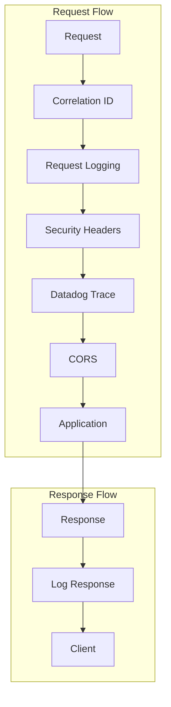
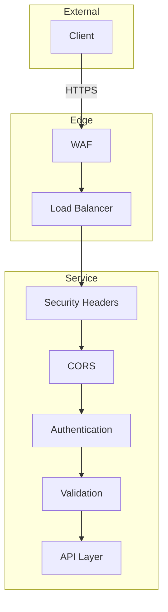

# Architecture Overview

## Service Architecture

```mermaid
flowchart TB
    subgraph External
        Client[Client Apps]
        DD[Datadog]
    end

    subgraph Kubernetes
        subgraph Service["${{values.name}}"]
            API[FastAPI :8000]
            Health[Health Probes]
        end

        
        subgraph Data
            DB[(Database)]
        end
        

        
        subgraph Cache
            Redis[(Redis)]
        end
        

        
        subgraph Messaging
            SQS[SQS Queue]
            
            SNS[SNS Topic]
            
        end
        
    end

    Client --> API
    Health --> DD

    
    API --> DB
    

    
    API --> Redis
    

    
    API --> SNS
    SNS --> SQS
    
    SQS --> API
    
```

## Request Flow

```mermaid
sequenceDiagram
    participant C as Client
    participant M as Middleware
    participant R as Router
    participant S as Service
    
    participant DB as Database
    
    participant DD as Datadog

    C->>M: HTTP Request
    Note over M: Correlation ID
    Note over M: Request Logging
    Note over M: Security Headers

    M->>R: Validated Request
    Note over R: Path Operation
    Note over R: Dependency Injection

    R->>S: Business Logic
    
    S->>DB: Query/Persist
    DB-->>S: Result
    

    S-->>R: Response
    R-->>M: Pydantic Model
    M-->>C: JSON Response

    M--)DD: Trace + Metrics
```

## Component Diagram

```mermaid
graph LR
    subgraph API Layer
        HR[Health Router]
        ER[Example Router]
        
        AIR[AI Router]
        
    end

    subgraph Service Layer
        ES[ExampleService]
        
        AIS[AIService]
        
    end

    subgraph Core
        CFG[Config]
        LOG[Logging]
        MW[Middleware]
        EXC[Exceptions]
    end

    subgraph Infrastructure
        
        DB[Database Session]
        
        
        RD[Redis Client]
        
    end

    ER --> ES
    
    AIR --> AIS
    
    
    ES --> DB
    
    
    ES --> RD
    
```

## Middleware Stack





## Event Flow (Messaging)

```mermaid
flowchart LR
    subgraph Producer Service
        API[API Handler]
        
        TX[(Transaction)]
        
    end

    subgraph Message Broker
        
        SNS[SNS Topic]
        
        SQS[SQS Queue]
        DLQ[Dead Letter Queue]
    end

    subgraph Consumer Service
        LC[Listener]
        CS[Consumer Service]
    end

    API -->|1. Publish| SNSSQS
    
    SNS -->|2. Fan-out| SQS
    
    SQS -->|3. Receive| LC
    LC -->|4. Process| CS
    SQS -->|Failed| DLQ
```


## Deployment Architecture

```mermaid
flowchart TB
    subgraph GitHub
        Repo[Repository]
        Actions[GitHub Actions]
    end

    subgraph Container Registry
        ECR[ECR]
    end

    subgraph Kubernetes Cluster
        subgraph Namespace
            Deploy[Deployment]
            SVC[Service]
            HPA[HPA]
            PDB[PDB]
        end

        subgraph Observability
            DDAgent[Datadog Agent]
        end
    end

    subgraph AWS
        
        Aurora[(Aurora)]
        
        
        DDB[(DynamoDB)]
        
        
        ElastiCache[(ElastiCache)]
        
        SM[Secrets Manager]
    end

    Repo -->|Push| Actions
    Actions -->|Build & Push| ECR
    Actions -->|Deploy| Deploy
    ECR --> Deploy
    SM --> Deploy
    Deploy --> SVC
    HPA --> Deploy
    PDB --> Deploy
    DDAgent --> Deploy

    
    Deploy --> Aurora
    
    
    Deploy --> DDB
    
    
    Deploy --> ElastiCache
    
```

## Security Model



## Directory Structure

```
src/
├── api/                 # API layer
│   ├── router.py        # Main router
│   ├── health.py        # Health endpoints
│   ├── deps.py          # Dependencies
│   └── v1/              # API version 1
│       └── example.py   # Example endpoints
├── core/                # Core functionality
│   ├── config.py        # Settings (Pydantic)
│   ├── logging.py       # Structured logging
│   ├── middleware.py    # Request middleware
│   └── exceptions.py    # Custom exceptions
├── models/              # Database models
│   ├── base.py          # Base model
│   └── example.py       # Example model
├── schemas/             # Pydantic schemas
│   └── example.py       # Request/Response DTOs
├── services/            # Business logic
│   └── example.py       # Example service
├── db/                  # Database layer
│   ├── session.py       # Session management
│   └── redis.py         # Redis client
└── main.py              # Application entry
```
